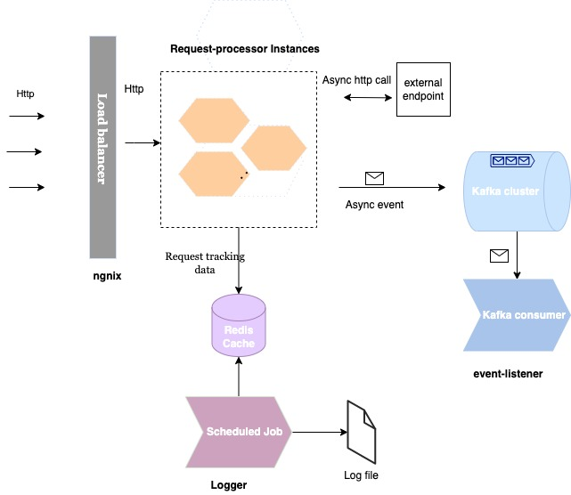

#  Smaato, Request forwarding and tracking API

An api that accepts and tracks requests received per minute, offers the possibility to forward the same to desired
endpoint.

**System design overview**

Below diagram depicts the high level components assembled to solve this problem.

**request processor service**
is the spring boot Java Rest API that accepts the requests, integrates with **Redis cache**. All the accepted unique
request ids by Counter instances are immediately sent over to redis cache. Requests to endpoint are forwarded
asynchronously and response status is shared as an event to a kafka topic. for more details
check `/request-processor/README.md`

**logger** comes with a scheduled job that runs every minute and logs the count of unique requests to a logfile.  
for more details check `/logger/README.md`

**event-listener**
Subscribes to the events published by request-processor for response status, listens and writes the same to log file.
for more details check `/event-listener/README.md`

All these components can be shipped as docker containers.To support the high volume requirements; multiple counter
instances are configured and are load balanced by **ngnix**.

** How to run ? All the application components are packaged under a docker specification (Docker-compose) and can be
started with following steps :

1. Make sure docker is installed
2. run command -  `docker-compose build`
3. run command - `docker-compose up`
4. application can be accessed on localhost:9090/api/smaato/accept?id=anyId or localhost:
   9090/api/smaato/accept?id=anyId&endPoint=any-end-point-location
5. Log file with generated count and response status can be accessed from container cli(/var/log of respective
   container) or via docker UI dashboard. Accessing from dashboard (docker dashboard -> volumes -> smaato ) :
    - For Unique request count access log file **accepted-request-count-logs.txt**
    - File name For Response status - **response-status-logs.txt**
Note: in case kafka doesn't start delete the old containers and redo the step 2 
   
**Assumptions/Limitations**

There are certain assumptions that drived few of the design decisions such as

1. Request count is tracked on per minute basis, and is calculated for the current minute, for example if first request
   is accepted on 08.01.27(hh.mm.ss), the first minute count will start by 8.01.27 and end by 08.01.59, though this can
   be enhanced to support more cases.
2. We need response status for endpoint eventually but not real time, thus response from the provided endpoint is made
   asynchronous to help reduce latency.
3. As of now redis cache is shared between instances, this is an antipattern for microservices, however can also be
   solved by either using distributed cache with locking or by making use of existing kafka streaming api.
4. No of instances of request processor will need adjustment to serve the traffic based on how a load test performs.